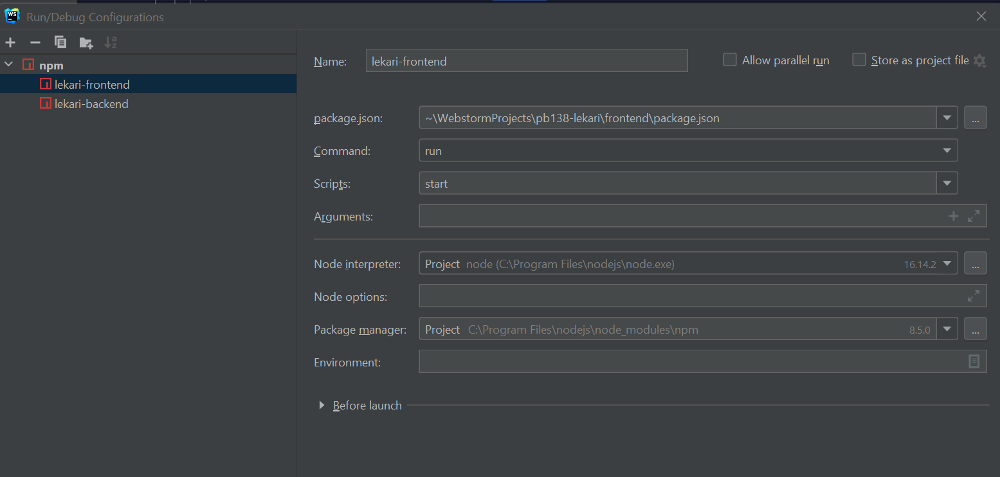
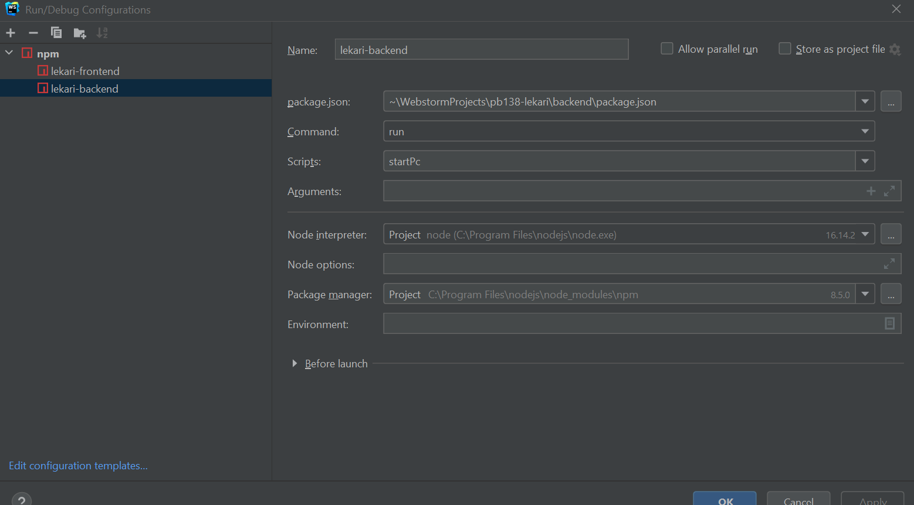

# PB138-Lekari

## Getting started in Webstorm

1. Open project: Get from VCS -> *https://gitlab.fi.muni.cz/xkoudel2/pb138-lekari.git*
2. In terminal, type *cd .\frontend\* or *cd .\backend\* to get to the corresponding subproject (or use *tab* to find the correct folder)
3. Type *npm i* in the project subfolder
4. Run the application via terminal command *npm run start* 
OR use webstorm Run (follow these steps to set up if not available by default):

    4.1. Go to Run -> Edit Configurations (on the top)

    4.2. Click on plus button to add a new configuration

    4.3 Choose npm

    4.4 Fill in the fields: Name = *any name of the configuration you want*, package.json = *choose path to fronted/backend package.json file*, Command = run, Scripts = start (backend), startPc (backend)
    
    4.5 From now on, you can always run the app in a standard way

5. Configure database using command: *npx prisma migrate dev --name db_init*

If prisma was not installed before:
$ npm i prisma
$ npx prisma generate

